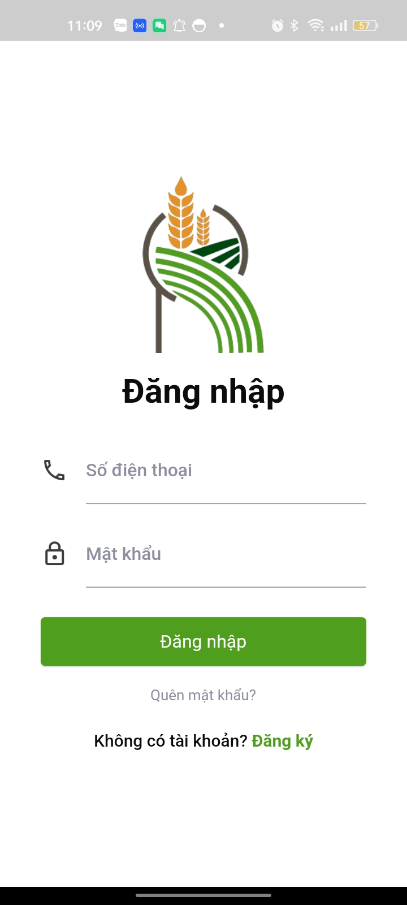
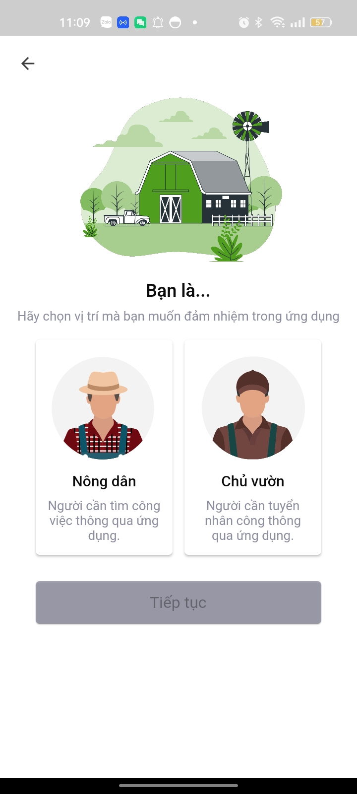
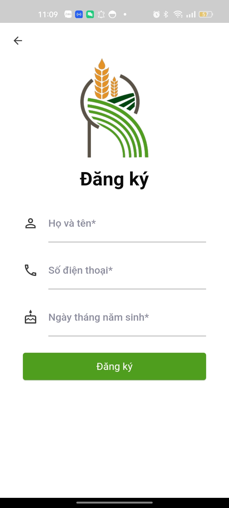
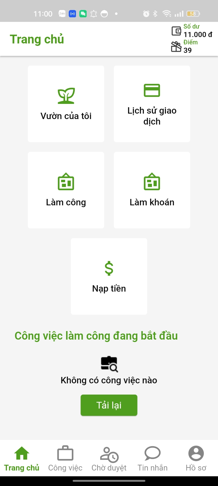
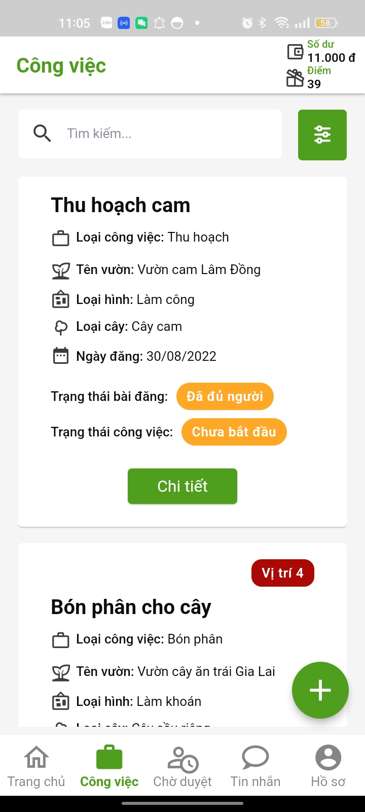
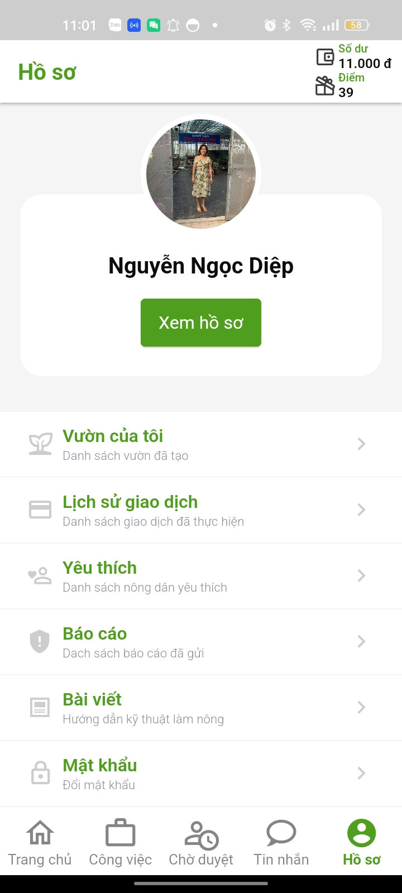
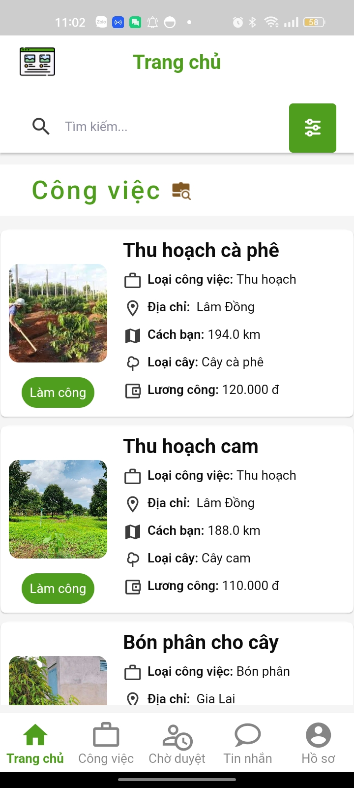
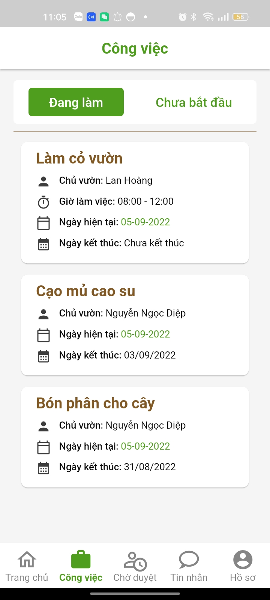
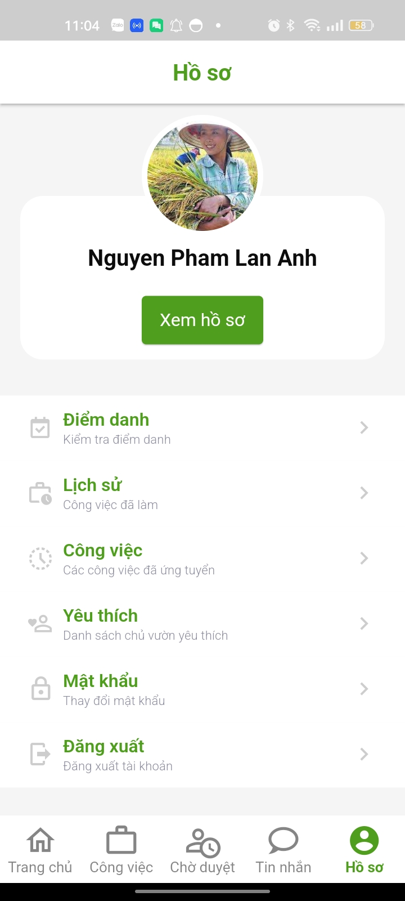

### _CONNECTING LANDOWNER AND FARMER SYSTEM_

## :writing_hand: Description

- MYRAY is built based on the current online recruitment systems to help farmers find jobs and landowners find appropriate farmers.
- **MYRAY_MOBILE** is an application for landowners and farmers to use.

## :camera_flash: ScreenShots

**1. Login**

   

    
   

**2. Register**

   

    
    
   

**3. Landowner Screens**

   

    
    
    
   

**4. Farmer Screens**

   

    
    
    
   

## :pushpin: Features

**1. Mobile application for landowners**:

    - Manage gardens, job posts.
    - Top up account.
    - Bookmark/un-bookmark account.
    - Report/feedback farmers.
    - Get total expense of each job.
    - Chat with farmers.

**2. Mobile application for farmers**:

    - Apply for jobs.
    - Request day offs.
    - Bookmark/un-bookmark account.
    - Report/feedback farmers.
    - Get total salary of each job.
    - Chat with farmers.

## :iphone: OS

## :computer: Techs

     
     
    
    
    

## :woman_technologist: Contributors:

